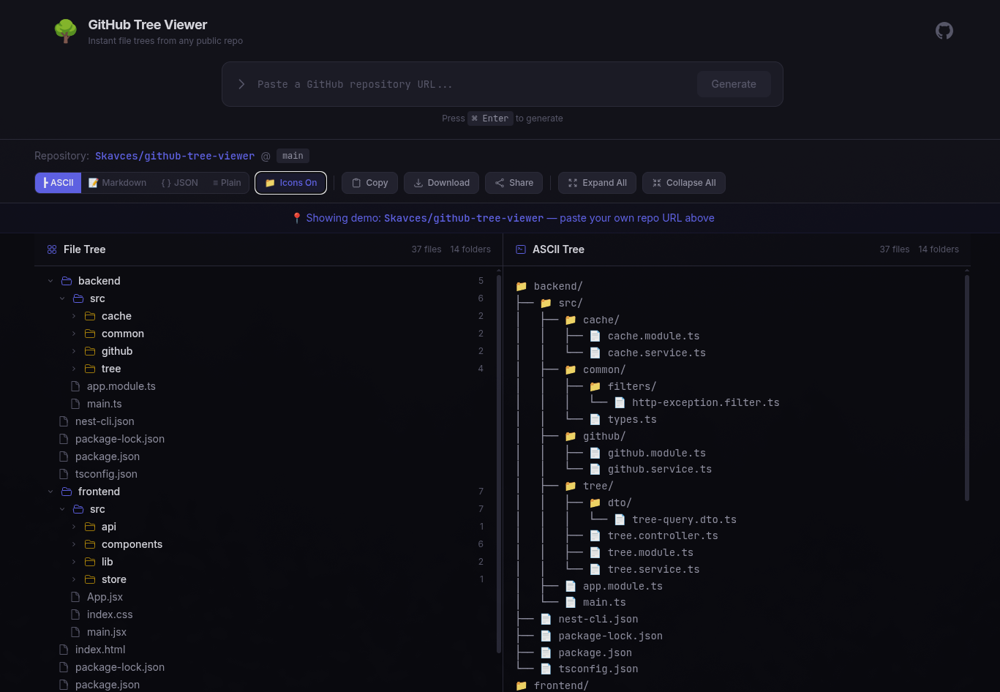

# GitHub Tree Viewer

A powerful web application that allows you to easily generate, view, and export the file tree structure of any public GitHub repository.



## 🚀 Features

- **Visualize GitHub Repositories**: Enter a GitHub repository URL to instantly view its directory and file structure.
- **Multiple Export Formats**: Export the generated file tree in various formats including:
  - ASCII
  - Markdown
  - JSON
  - Plain Text
- **Customizable Output**: Toggle options to include or exclude file icons in the exported tree.
- **Modern UI**: Built with a sleek, responsive, and user-friendly interface using React and Tailwind CSS.
- **Rate Limited API**: Backend API protected with rate limiting to ensure stable performance.

## 🛠️ Tech Stack

### Frontend

- **Framework**: [React 18](https://react.dev/) + [Vite](https://vitejs.dev/)
- **Styling**: [Tailwind CSS](https://tailwindcss.com/)
- **State Management**: [Zustand](https://zustand-demo.pmnd.rs/)
- **Data Fetching**: [TanStack React Query](https://tanstack.com/query/latest)
- **UI Components**: [Radix UI](https://www.radix-ui.com/) (Collapsible, Toast)

### Backend

- **Framework**: [NestJS](https://nestjs.com/)
- **Validation**: [Zod](https://zod.dev/)
- **Rate Limiting**: NestJS Throttler

## 📦 Installation & Setup

### Prerequisites

Ensure you have the following installed:

- Node.js (v18+ recommended)
- npm (Node Package Manager)

### 1. Clone the repository

```bash
git clone https://github.com/Skavces/github-tree-viewer
cd github-tree-viewer
```

### 2. Backend Setup

Open a terminal and navigate to the backend directory:

```bash
cd backend
npm install
npm run start:dev
```

The NestJS server will start in development mode with hot-reloading.

### 3. Frontend Setup

Open a new terminal window and navigate to the frontend directory:

```bash
cd frontend
npm install
npm run dev
```

The Vite development server will start. Open your browser and navigate to the local URL provided (usually `http://localhost:5173`).

## 📜 Available Scripts

### Backend (`/backend`)

- `npm run start`: Starts the NestJS server.
- `npm run start:dev`: Starts the NestJS server in watch mode.
- `npm run build`: Compiles the application into the `dist` folder.
- `npm run start:prod`: Runs the compiled application.

### Frontend (`/frontend`)

- `npm run dev`: Starts the Vite development server.
- `npm run build`: Builds the app for production to the `dist` folder.
- `npm run preview`: Locally preview the production build.

## 📄 License

This project is open-source and available under the MIT License.
